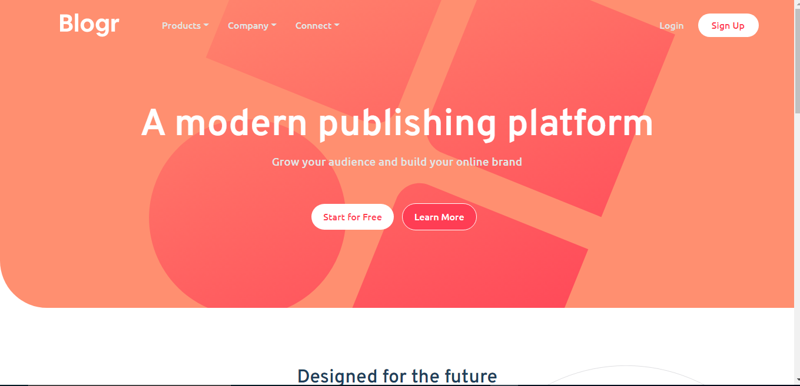
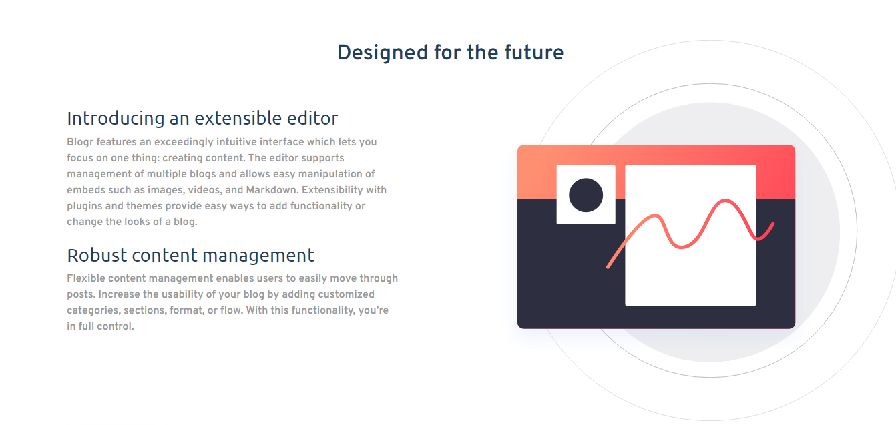
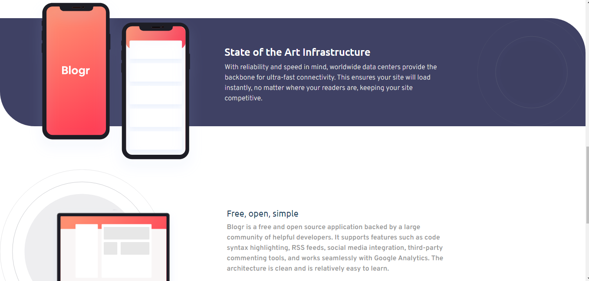
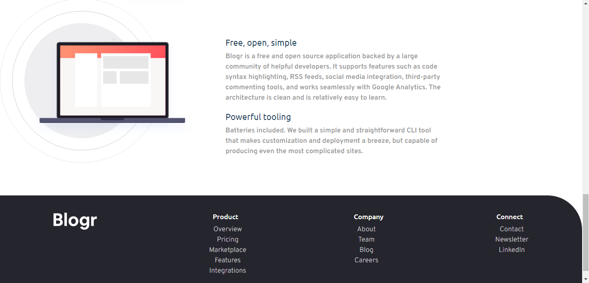
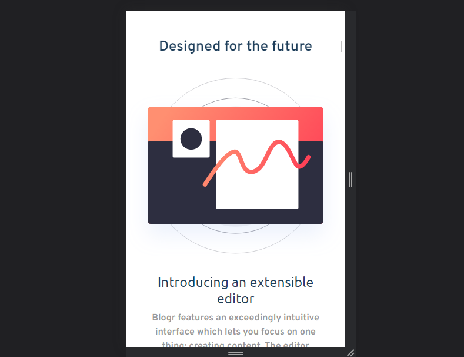
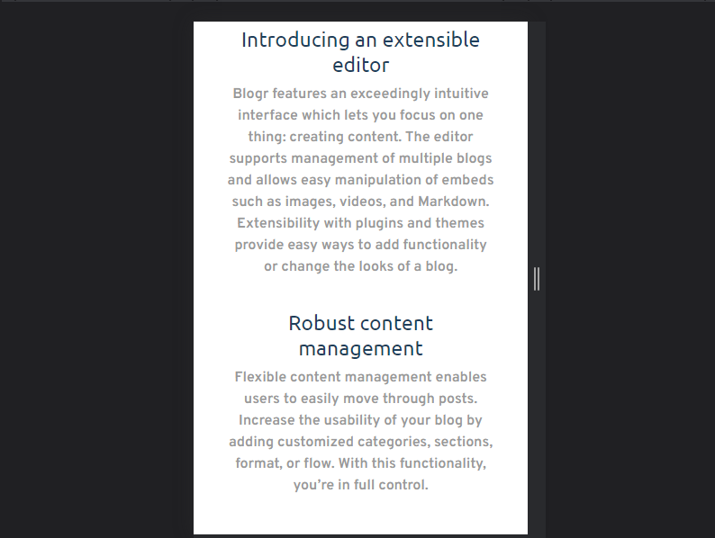
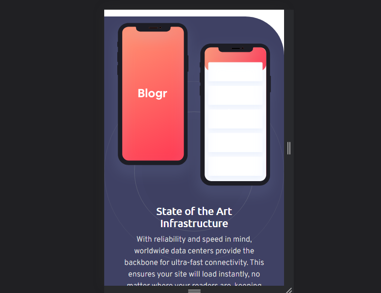
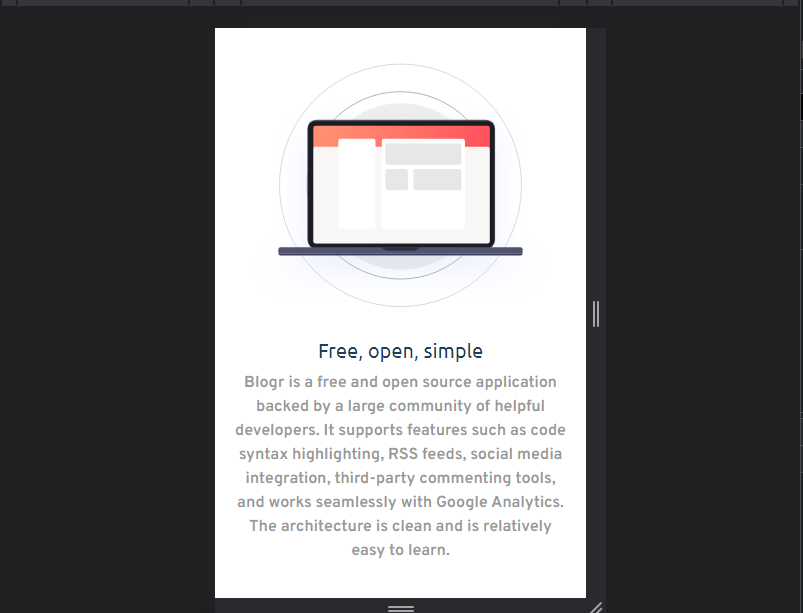
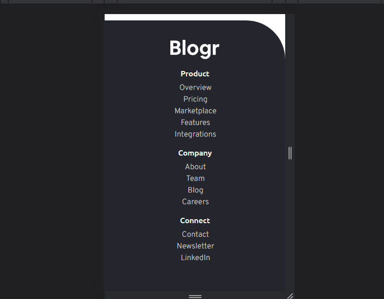

# Frontend Mentor - Blogr landing page solution

This is a solution to the [Blogr landing page challenge on Frontend Mentor](https://www.frontendmentor.io/challenges/blogr-landing-page-EX2RLAApP). Frontend Mentor challenges help you improve your coding skills by building realistic projects. 

## Table of contents

- [Overview](#overview)
  - [The challenge](#the-challenge)
  - [Screenshot](#screenshot)
  - [Links](#links)
  - [Built with](#built-with)
  - [What I learned](#what-i-learned)
- [Author](#author)
- [Acknowledgments](#acknowledgments)


## Overview

FEM Blogr Landing Page


### The challenge

Users should be able to:

- View the optimal layout for the site depending on their device's screen size
- See hover states for all interactive elements on the page

### Screenshot













### Links

- Solution URL: [Git repo link](https://github.com/Plut0r/blogr-page)
- Live Site URL: [Netlify live url](https://blogr-page-plut0r.netlify.app/)


### Built with

- Semantic HTML5 markup
- CSS custom properties
- Flexbox

### What I learned

To stop the contents of the toggled navbar from pushing the content down.
````css
.navbar-brand {
  position: absolute;
  z-index: 1;
  width: 100%;
}
````

To get rid of whitespace in screens lesser than desktop width.
````css
@media screen and (max-width: 900px) {
  * {
    overflow-x: hidden;
  }
}
````

## Author

- Frontend Mentor - [@Plut0r](https://www.frontendmentor.io/profile/Plut0r)
- Linkedin - [@Plutor](https://www.linkedin.com/in/plut0r)


## Acknowledgments

Stackoverflow helped me with getting rid of whitespace and the toggling issue.
